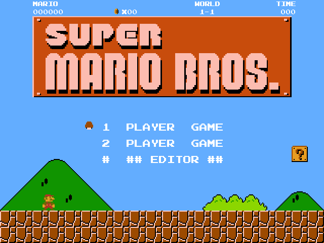
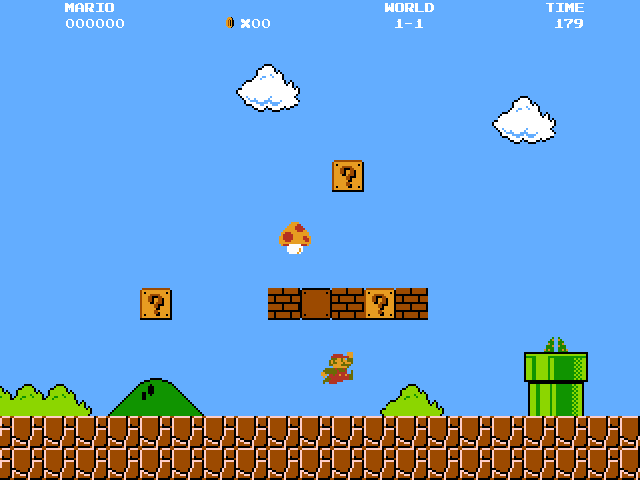
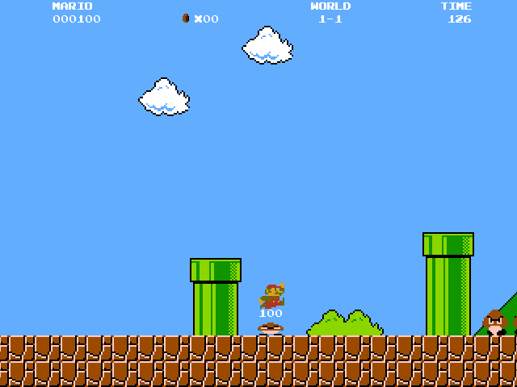
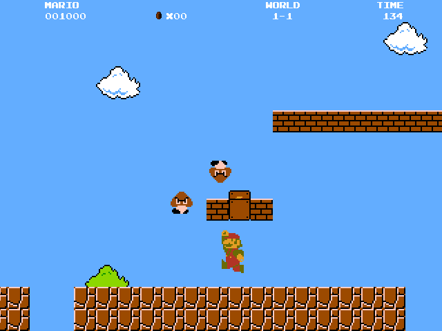
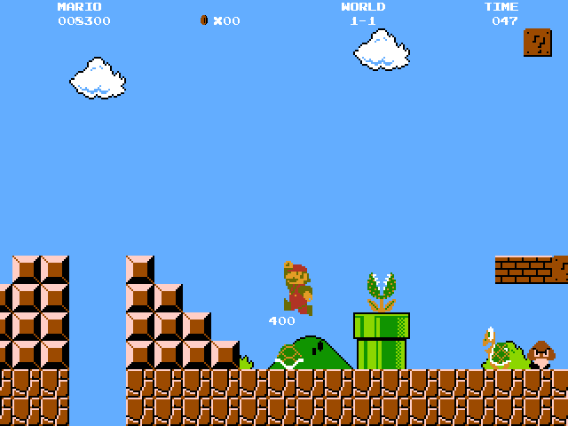

# Super-Mario-Bros

This is a clone of the legendary NES game Super Mario Bros with an in-game level editor implemented using C++ and HGE(Haaf's game engine).

 You can find a compiled version of the game inside the 'bin' directory

## Screenshots

